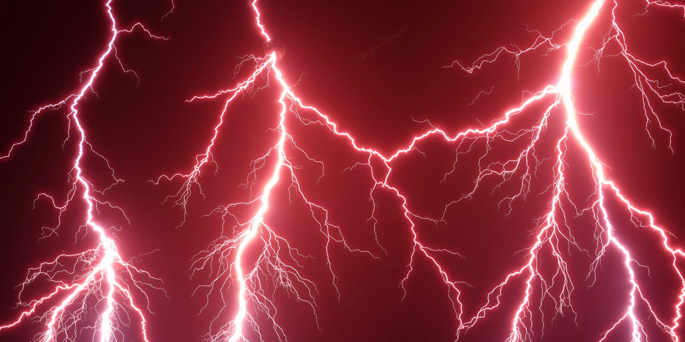

# Electricity Demand Management



**Author:** Pirate-Emperor

**Project Overview:** This project leverages machine learning (ML) models to forecast and optimize electricity demand, particularly during peak periods. The goal is to balance energy supply and demand, reducing the risk of power outages and improving grid stability.

## Demo Video
[](https://www.youtube.com/watch?v=3-vEIQ4YiVA)

## Abstract

India is the world's third-largest energy consumer, with its energy needs escalating from 106.6 billion units (BU) in 2019 to 132 BU in 2022. This increasing demand is largely met by coal reserves, which are depleting rapidly and causing frequent power blackouts. According to the World Bank, India loses about $86 billion annually due to power sector inefficiencies and blackouts. The lack of coordination among various ministries contributes to these challenges, leading to widespread power disruptions.

This project aims to mitigate these issues by aligning energy demand with supply, thereby reducing the likelihood of grid failures that disrupt essential services such as metro systems, hospitals, and communication networks. The approach involves studying both industrial and domestic consumption patterns, which account for 41.09% and 25.67% of total power usage, respectively. By employing techniques like DTW/K-means clustering and LLM models, the project suggests methods to optimize electricity production and consumption while considering factors like weather patterns, geographical location, and transmission constraints. Enhanced forecasting, incorporating weather data and historical patterns, will enable flexible generation scheduling to stabilize the grid and provide users with actionable insights to manage their electricity consumption.

## Key Features

- **Load Forecasting:** Predicts future electricity demand using historical consumption data and ML models.
- **Demand Response:** Implements strategies to shift or reduce load during peak times, preventing grid overload.
- **Optimization:** Applies advanced optimization techniques to distribute loads evenly and reduce peak demand.
- **Cost Efficiency:** Offers solutions to minimize electricity costs during peak hours through smart management.
- **User-friendly Interface:** Features an intuitive dashboard for easy monitoring and decision-making.

## Project Description

**Topic:** Demand Response Solutions for Peak Load Management

The primary objective of this project is to ensure a stable electricity supply across all regions of India, 24/7. This is achieved by flattening the electricity demand curve, as sudden fluctuations can lead to machine failures, energy wastage, and ultimately, power outages. By encouraging users to modify their consumption behavior, the project aims to balance electricity demand, thereby minimizing the risk of grid failures and power outages.

### Key Objectives:

1. **Prevent Power Outages:** Flatten the demand curve to stabilize the electricity grid.
2. **Reduce Grid Failures:** Minimize sudden fluctuations in demand that can disrupt grid stability.
3. **Targeted Solutions:** Focus on domestic households and small to medium-sized businesses, where electricity management is less optimized.
4. **Adaptation of Renewable Energy:** Address the challenges posed by the variability of renewable energy sources, such as solar power during the rainy season.
5. **Industrial Sector Considerations:** While large-scale industries have organized electricity management systems, this project targets smaller sectors where optimization can have a significant impact.

### Challenges:

- **Variable Demand:** Uncertainty due to weather changes, holidays, and varying household needs.
- **Variable Generation:** Power outages and maintenance issues that affect generation capacity.
- **Grid Stability:** The need to maintain a constant balance between supply and demand to avoid grid disruptions.
- **Integration of Renewable Energy:** The impact of weather variability on renewable energy usage.
- **Appliance-specific Data:** The lack of detailed metering data for specific appliances in domestic settings.

## Prerequisites

To run this project, you will need:

- Python 3.x
- Required Python libraries (numpy, pandas, scikit-learn, matplotlib, etc.)

## Installation

Follow these steps to set up the project:

1. **Clone the repository:**

   ```bash
   git clone https://github.com/Pirate-Emperor/Electricity_Demand_Management.git
   cd Electricity_Demand_Management
   ```

2. **Install the required Python packages:**

   ```bash
   pip install -r requirements.txt
   ```

## Usage

To run the project:

1. Execute the main script:

   ```bash
   python main.py
   ```

   The script will use historical electricity consumption data to train ML models, predict future demand, and apply demand response strategies to optimize electricity usage during peak hours.

## Data Source

The project relies on historical electricity consumption data with time-series information, such as date, time, and electricity usage. This data is obtained from public datasets.

## Development

For those interested in contributing to the project, potential areas for improvement include:

- Exploring more advanced ML models for load forecasting.
- Enhancing demand response strategies for better load management.
- Integrating external factors like weather forecasts for more accurate predictions.
- Improving the user experience through dashboard enhancements.

## License

This project is licensed under the MIT License. See the [LICENSE.md](LICENSE.md) file for details.